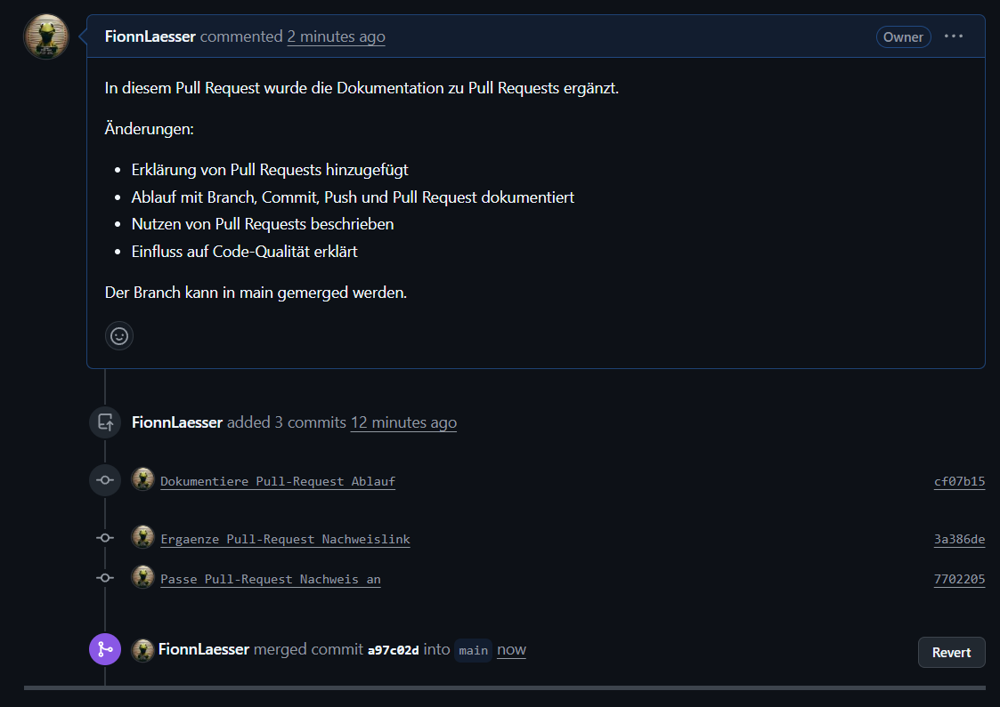
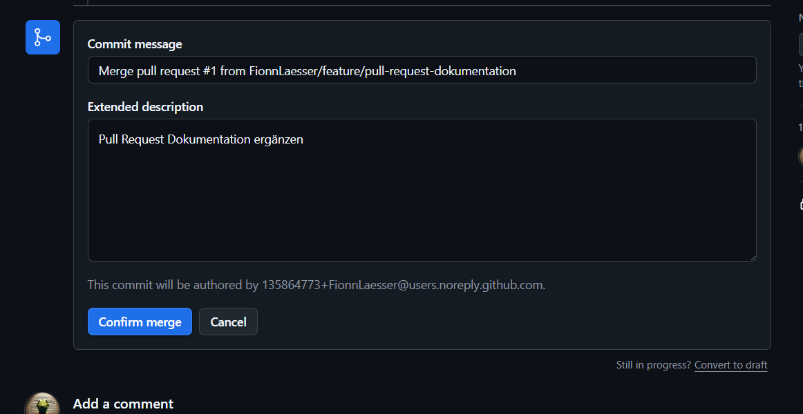

# Pull Request Dokumentation

Stand: 22.05.2026

## Was ist ein Pull Request?

Ein Pull Request ist eine Anfrage, Änderungen aus einem Branch in einen anderen
Branch zu übernehmen. In unserem Projekt wird dafür ein Feature-Branch verwendet,
der später in den `main`-Branch gemerged wird.

Bei GitLab heisst das gleiche Prinzip meistens Merge Request. Die Bedeutung ist
gleich: Änderungen werden zuerst separat vorbereitet und danach überprüft, bevor
sie in den Hauptstand des Projekts übernommen werden.

## Warum verwendet man Pull Requests?

Pull Requests helfen dabei, Änderungen kontrolliert in ein Projekt zu übernehmen.
Sie sind besonders nützlich, wenn mehrere Personen am gleichen Projekt arbeiten.

- Änderungen werden überprüft, bevor sie in `main` kommen.
- Andere Personen können Feedback geben.
- Fehler werden früher erkannt.
- Die Code-Qualität wird verbessert.
- Der `main`-Branch bleibt stabiler.
- Der Ablauf bleibt nachvollziehbar, weil Commits, Kommentare und Reviews im Pull Request sichtbar sind.

## Vorbereitung

Vor dem Erstellen eines Pull Requests wird zuerst ein eigener Branch erstellt.
Dieser Branch enthält die Änderungen, die später in `main` übernommen werden
sollen.

Wichtige Git-Befehle:

```bash
git checkout main
git pull origin main
git checkout -b feature/pull-request-dokumentation
git status
git add .
git commit -m "Dokumentiere Pull-Request Ablauf"
git push origin feature/pull-request-dokumentation
```

In unserem Projekt wurde der Branch `feature/pull-request-dokumentation`
verwendet. Die Änderungen wurden dort vorbereitet und anschliessend auf GitHub
hochgeladen.

## Pull Request erstellen

Nach dem Push des Feature-Branches kann auf GitHub ein Pull Request erstellt
werden. Dabei wird ausgewählt, von welchem Branch in welchen Zielbranch gemerged
werden soll.

Für dieses Projekt war die Auswahl:

- Base-Branch: `main`
- Compare-Branch: `feature/pull-request-dokumentation`

Danach wurden ein Titel und eine Beschreibung ergänzt. Die Beschreibung sollte
kurz erklären, was geändert wurde und warum diese Änderung gemacht wurde.


## Pull Request überprüfen

Nach dem Erstellen des Pull Requests zeigt GitHub an, ob die Änderungen gemerged
werden können. Wichtig ist, dass keine Merge-Konflikte vorhanden sind.

In unserem Fall zeigte GitHub den Status `Ready to merge`. Ausserdem wurde
angezeigt, dass keine Konflikte mit dem Base-Branch vorhanden waren. Damit war
der Pull Request technisch bereit für den Merge.


## Pull Request mergen

Wenn der Pull Request überprüft wurde und keine Konflikte vorhanden sind, kann er
in den `main`-Branch gemerged werden. Dafür wird auf GitHub zuerst die Schaltfläche
`Merge pull request` verwendet.

Anschliessend muss der Merge nochmals bestätigt werden. Dieser Schritt verhindert,
dass Änderungen versehentlich in `main` übernommen werden.



Nach der Bestätigung zeigt GitHub an, dass der Pull Request erfolgreich gemerged
wurde. Die Änderungen sind damit im `main`-Branch enthalten.



## Nachweise mit Screenshots

Die folgenden Screenshots dokumentieren den Ablauf des Pull Requests.

| Datei | Zweck | Status |
| --- | --- | --- |
| `01_pr_problem_keine_rechte.png` | Zeigt, dass zuerst kein Pull Request ins WISS-GB Repository erstellt werden konnte, weil nur Collaborators berechtigt waren. | TODO: Screenshot `01_pr_problem_keine_rechte.png` einfügen |
| `02_pr_erstellen_formular.png` | Zeigt das Formular zum Erstellen des Pull Requests mit Titel und Beschreibung. | Vorhanden |
| `03_pr_offen_ready_to_merge.png` | Zeigt den geöffneten Pull Request mit Status ready to merge und ohne Konflikte. | Vorhanden |
| `04_pr_confirm_merge.png` | Zeigt den Schritt Confirm merge. | Vorhanden |
| `05_pr_erfolgreich_gemerged.png` | Zeigt, dass der Pull Request erfolgreich in `main` gemerged wurde. | Vorhanden |

TODO: Screenshot `01_pr_problem_keine_rechte.png` einfügen, sobald der passende
Screenshot vorhanden ist.

## Nutzen von Pull Requests

Pull Requests erleichtern die Zusammenarbeit, weil Änderungen nicht direkt in den
`main`-Branch geschrieben werden. Stattdessen werden sie zuerst in einem eigenen
Branch gesammelt und danach überprüft.

Ein grosser Vorteil ist, dass andere Personen den Code anschauen können, bevor er
übernommen wird. Dadurch können Fehler, unklare Stellen oder fehlende Tests früher
gefunden werden. Auch die Beschreibung im Pull Request hilft, die Änderung später
nachzuvollziehen.

Pull Requests können aber auch zusätzlichen Aufwand verursachen. Für sehr kleine
Änderungen dauert der Ablauf manchmal länger als ein direkter Commit. Ausserdem
kann ein Pull Request blockiert werden, wenn Reviews fehlen oder wenn es
Merge-Konflikte gibt.

Trotzdem ist der Nutzen für ein Teamprojekt grösser als der Aufwand. Pull Requests
verbessern die Code-Qualität, machen Änderungen transparenter und schützen den
`main`-Branch vor fehlerhaften oder unvollständigen Änderungen.

## Fazit

In diesem Projekt wurde ein Feature-Branch erstellt, die Dokumentation zu Pull
Requests ergänzt und der Branch über einen Pull Request in `main` gemerged. Die
Screenshots zeigen die wichtigsten Schritte: Pull Request erstellen, Status prüfen,
Merge bestätigen und erfolgreichen Merge kontrollieren.

## Quellen

- GitHub Docs: About pull requests, https://docs.github.com/en/pull-requests/collaborating-with-pull-requests/proposing-changes-to-your-work-with-pull-requests/about-pull-requests
- GitHub Docs: Creating a pull request, https://docs.github.com/en/articles/creating-a-pull-request
- GitHub Docs: Merging a pull request, https://docs.github.com/en/pull-requests/collaborating-with-pull-requests/incorporating-changes-from-a-pull-request/merging-a-pull-request
